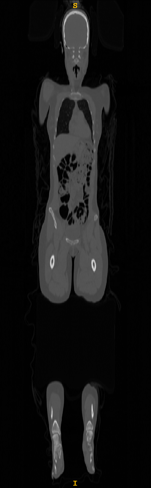
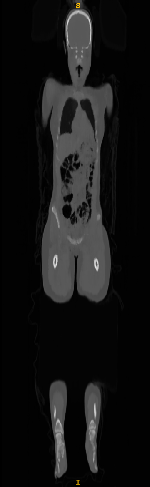
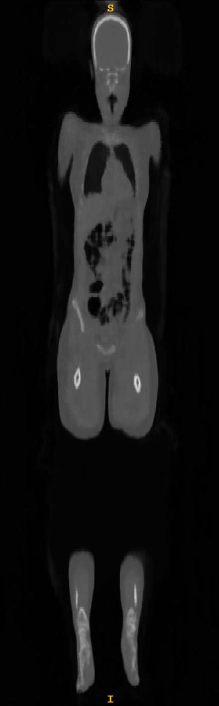
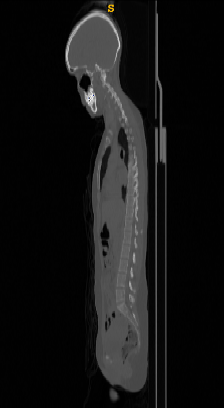
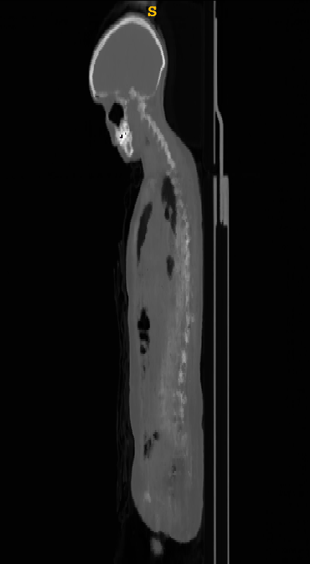

# CT-NeRF

This is a private project started by me during the fall of 2024. It aims to use a modified version of the the work presented in [NeRF: Representing Scenes as
Neural Radiance Fields for View Synthesis](https://arxiv.org/abs/2003.08934) to construct a CT image from a series of X-ray (projectional radiography) images from different angles. 

Modifications include:
- Using the trained model to construct a CT image by sampling the model in a 3D grid rather than along rays. 
- Training the model to predict only [linear attenuation coefficients](https://en.wikipedia.org/wiki/Attenuation_coefficient) (what the authors of the orinial NeRF paper call density, $\sigma$). Colour is not needed since a CT image is just a rescaled mapping of linear attenuation coefficients and thus has no colour. The output of a ray $\mathbf{r}$ is therefore its transmittance $T(\mathbf{r})$ after passing through the subject rather than a colour. 
- Removing the viewing angle dependent part of the original NeRF model. The angle dependent part is not needed since colours are not being predicted, and X-ray absorption does not depend on incidence angle of the ray.
- Unlike in a normal pinhole camera, in an X-ray camera the light rays that produce the image are all parallel and orthogonal to the image plane <sup>(almost, see assumptions and simplifications below)</sup>. Additionally, each ray has a constant z value, i.e. it travels horizontally. 
- Simplifying the calculation of the output pixel values to a modified version of the [Beer-Lambert Law](https://en.wikipedia.org/wiki/Beer%E2%80%93Lambert_law): $T\left(\mathbf{r}\right)=\frac{\ln\left(\exp\left[-\sum_{i=1}^{N}{\sigma_i\delta_i}\right]+k\right)}{s}$. The logarithm and scaling parameters $s$ and $k$ were added to compensate for the fact the the X-ray image intensities had been scaled by $T_{new} = \frac{\ln\left(T_{old}+k\right)}{s}$ to enhance the contrast. The transmittance in a raw digital X-ray image is close to 0 throughout the entire body, with only minute differences visible. Scaling and taking the logarithm can greatly enhance the contrast, improving the model's ability to learn. 
- Implementing a fine sampling scheme focused on edges in the output of the coarse model. A PDF of $` \hat{w} _i `$ defined by $` w _i =\frac{\left |\sigma_ {i+1}-\sigma_ {i}\right|}{\delta_i}, \hat{w} _i=w _i/\sum _{j=1} ^ {N _c}{w _j} `$ was used to create this effect, which helps the fine model focus on learning where edges between tissues are located. This helps give clearly defined organ boundaries. 
- Skriv om fler samplingstrategier
- Skriv om aktiveringsfunktioner

## X-ray creation

Since I could not find any datasets consisting of whole body X-ray images from multiple angles, with exact angle annotations (why would such a dataset even exist?), I wrote code for creating simulated X-ray images from a CT image. This involves rescaling from [Hounsfield Units](https://en.wikipedia.org/wiki/Hounsfield_scale) to linear attenuation coefficients and applying a discretized version of the Beer-Lambert law along the desired angle. In practice, applying the Beer-Lambert law along an angle $\theta$ involves rotating the CT image $\theta$ degrees and applying the Beer-Lambert law along the x-axis.

## Implementation details

The NeRF model and ray tracing was implemented in PyTorch. To make the project more challenging, everything was written by hand, no code was taken from existing NeRF implementations. Care was taken to ensure the code runs efficiently. The NeRF model was trained to construct its representation of the CT image in a cube of size $2\times 2\times 2$ with its centre at the origin. 

### Ray tracing

A ray in three dimensions can be parameterized by a single scalar $t$ as $\mathbf{p}+t\cdot\mathbf{v}$, with $\mathbf{p}$ being a point on the ray and $\mathbf{v}$ being the heading vector of the ray. For an X-ray image of size $(w_{im}, h_{im})$ taken from an angle $0$, that is head on, the starting position $\mathbf{p}(y, z, 0)$ and heading vector $\mathbf{v}(0)$ of the ray associated with pixel $(y,z)$ are 

$$
\mathbf{p}(y, z, 0)=\begin{bmatrix}1 & \frac{2y}{w_{im}}-1 & \frac{2z}{h_{im}}-1\end{bmatrix}^T $$
$$
\mathbf{v}(0)=\begin{bmatrix}-1 & 0 & 0 \end{bmatrix}^T
$$

That is, the ray starts at $x=1$ and heads in the negative x direction. This works because unlike in a normal camera, in an X-ray camera the light rays creating the image are more or less parallel and orthogonal to the image plane. Since the start position is at $x=1$, $\mathbf{v}(0)$ is a unit vector, and the model space is a cube with a side of $2$, it holds that $t \in [0,2]$. 

For pixel $(y,z)$ in an X-ray image taken from angle $\theta$, the starting point $\mathbf{p}(y,z,\theta)$ and heading vector $\mathbf{v}(\theta)$ can be calculated by rotating $\mathbf{p}(y, z, 0)$ and $\mathbf{v}(0)$ by $\theta$ around the z-axis: 

$$\mathbf{R}_z(\theta)=\begin{bmatrix} \cos{\theta} & -\sin{\theta} & 0 \\\ \sin{\theta} & \cos{\theta} & 0 \\\ 0 & 0 & 1 \end{bmatrix}$$
$$\mathbf{p}(y, z, \theta)=\mathbf{R}_z(\theta)\mathbf{p}(y,z,0)$$
$$\mathbf{v}(\theta)=\mathbf{R}_z(\theta)\mathbf{v}(0)=\begin{bmatrix} \cos{\theta} & -\sin{\theta} & 0\end{bmatrix}^T$$

Thus, the ray associated with pixel $(y,z)$ of an X-ray image taken from angle $\theta$ can be parameterized as $\mathbf{p}(y,z,\theta)+t\cdot\mathbf{v}(\theta)$ with $t\in[0,2]$. Sampling points along the ray is then as simple as sampling different values of $t$.

A consequence of this sampling scheme is that the edges of the image will not be reached by rays from all angles, since the size of the cube is greater than $2$ along some directions. Also, some rays will reach outside the cube. This should not be a problem, as the middle of the image, where the subject is located, is hit by rays from every angle. An alternative sampling scheme where samples of $t$ are only drawn from the central cylinder of the cube, $x^2+y^2=1$, was also implemented and tested. For a starting position $`\begin{bmatrix} a & b & c \end{bmatrix} ^T`$ and heading vector $`\begin{bmatrix} v_x & v_y & 0 \end{bmatrix} ^T`$, this corresponds to $t\in\left[-(av_x+bv_y)\pm\sqrt{(av_x+bv_y)^2-(a^2+b^2-1)}\right]$. 

### Image I/O

Reading and writing CT and X-ray images was done using [SimpleITK](https://simpleitk.org/). Because of this, the X-ray images can be supplied in any file format that can be read by SimpleITK, and the CT image can be outputted in any file format SimpleITK can write. The CT image for creating simulated X-ray images (see below) can also be in any file format supported by SimpleITK. 

Training and CT creation requires the presence of a meta.json file in the X-ray directory, containing (at minimum) "file_angle_map", a mapping of X-ray filenames to angles in degrees, "spacing", a list of length 2 descibing pixel the X-ray images' pixel spacing, and "size", a list of length 2 descibing the size of the X-ray images in pixels. Example meta.json file:

```
{
    "file_angle_map": {
        "xray1.nii.gz": 0,
        "xray2_nii.gz": 1,
        "xray3_nii.gz": 2,
        ...
    },
    "spacing": [
        1.5234375,
        3.0
    ],
    "size": [
        512,
        536
    ],
}
```
The script supplement_metadata.py can add spacing and size (among other things) to the metadata given a sample X-ray image. 

During implementation, care was taken to use correct units of length in the Beer-Lambert law, meaning the model learns to output linear attenuation coefficients, enabling creation of CT images with values in Hounsfield units. 

### Training and inference configuration

Configuration of training and inference scripts is done by YAML files. Sample YAML config files with documentation are included in the repository.

## Results

Two model sizes were tested: a small model, consisting of 8 layers of 128 hidden units each, and a large model, consisting of 16 layers of 384 units each. The small model achieved its best results with exponential scaling of X-rays, whereas the large model performed best with the linear scaling and logarithm-modified Beer-Lambert law. The large model got a mean absolute error of 13.8 HU per voxel and the small model 16.7 HU. As can be seen in the images below, the small model produced blurrier images contrast between tissues than the large model. Both models struggled with fine details such as the vertebrae. 

<p float="left">
  
  
  
  <figcaption>Frontal plane slices. Left to right: Source CT image, image created by a model with 16 layers of dimension 384, image created by a model with 8 layers of dimension 128.</figcaption> 
</p>

<p float="left">
  
  
  
  <figcaption>Sagittal plane slices. Left to right: Source CT image, image created by a model with 16 layers of dimension 384, image created by a model with 8 layers of dimension 128.</figcaption> 
</p>

## Assumptions and simplifications

It was assumed that all X-ray photons have an energy of 50 keV. This is not true, [the X-rays used in X-ray imaging cover a broader spectrum](https://en.wikipedia.org/wiki/X-ray#Production_by_electrons). However, the spectrum is centered around roughly 50 keV, and all photons in the spectrum have [roughly the same linear attenuation coefficients in the tissues of the human body](https://physics.nist.gov/PhysRefData/XrayMassCoef/tab4.html). 

In this project, it was assumed that all the X-rays that create an X-ray image are parallel and orthogonal to the image plane. This is strictly not true, as there is some [geometric magnification](https://en.wikipedia.org/wiki/Projectional_radiography#Geometric_magnification). If real X-ray images were used, this would cause blurring of the CT image unless the geometric magnification was accounted for. 

While using CT images to generate X-ray images avoids the issue of geometric magnification, it also limits the possible output resolution. The model cannot possibly learn more details than are present in the original CT image. If a series of real X-ray images were used to train the model, their combined information content could feasibly result in the model learning a higher resolution representation of the subject than in any individual X-ray image. 

None of the ray sampling methods implemented are able to sample densely in the corners of the model space. This was deemed to be acceptable since real CT images are void of information outside the central cylinder, typically being padded with -1024 HU. However, if X-ray images were used that only covered a limited part of the body and therefore filled out the model space entirely, the corners would likely have low resolution or incorrect reconstruction.  

## How to run it

- <code>pip install -r requirements.txt</code>
- place CT image in <code>data/ct_images</code>
- run <code>scripts/generate_xrays.py</code>, specifying CT path and output path, as well as angles
- modify <code>config_yamls/train_config.yaml</code> to specify training parameters
- run <code>scripts/train.py</code>
- update <code>inference_config.yaml</code> with correct hyperparameters and model path
- run <code>scripts/generate_ct.py</code>

## Todo list

* Expand section How to run it
* Expand section Results
* Write a section Experiments with description of hyperparameters, etc. 
* Describe sampling functions in more detail.
* Describe the exponential scaling in this readme.
* Scale input images to [0, 1]. Currently, they are in the range [-2.3, 0]. This is because the original X-rays are [0, 1], but to achieve better contrast inside the image, they are scaled and logarithm'd. After this contrast adjustment, rescaling could be performed to adjust the value range to something more suitable for NN's. 
* Try different activation functions for the last layer. The model outputs the transmittance at each pixel. This is a value in the range [0, 1]. Currently, the model has no activation function on its output layer. However, an activation function could be used to introduce inductive bias to the model by limiting its output values, for example with a sigmoid function that limits the output to [0, 1].
* Try different model sizes
* Try varying batch size, learning rate, training time. Lower learning rate with larger batch size and longer training time could probably give better results
* Test how many X-ray images are needed for good reconstruction